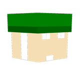

<!DOCTYPE html>
<html lang="en">
<head>
  <meta charset="UTF-8" />
  <meta name="viewport" content="width=device-width, initial-scale=1.0" />
  <title>LamaSMP Store</title>
  <meta name="description" content="Official LamaSMP Store — support the server and unlock awesome perks." />
  <link rel="preconnect" href="https://fonts.googleapis.com" />
  <link rel="preconnect" href="https://fonts.gstatic.com" crossorigin />
  <link href="https://fonts.googleapis.com/css2?family=Inter:wght@400;500;600;700&family=Outfit:wght@500;600;700;800&display=swap" rel="stylesheet" />
  <link rel="stylesheet" href="styles.css" />
  <link rel="icon" href="logo.png" />
</head>
<body>
  <!-- decorative background -->
  

  

  

  <!-- ===== Header ===== -->
  <header class="header" id="header">
    

      <a class="brand" href="#top">
        
        
          LamaSMP
          Store
        
      </a>

      <nav class="nav" aria-label="Primary">
        <a href="#store">Store</a>
        <a href="#about">About</a>
        <a href="https://discord.gg/zHww5mrcPS" target="_blank" rel="noopener">Support</a>
      </nav>

      

        
           Live
        
        <button class="cart-btn" id="cartBtn" aria-label="Open cart">
          <svg viewBox="0 0 24 24" width="20" height="20" fill="none" stroke="currentColor" stroke-width="1.8" stroke-linecap="round" stroke-linejoin="round"><circle cx="9" cy="21" r="1"/><circle cx="20" cy="21" r="1"/><path d="M1 1h4l2.68 13.39a2 2 0 0 0 2 1.61h9.72a2 2 0 0 0 2-1.61L23 6H6"/></svg>
          0
        </button>
      

    

  </header>

  <main id="top">
    <!-- ===== Store (categories) — top ===== -->
    <section class="store" id="store">
      

        

          <h2 class="section-title">Store</h2>
          
Pick a category to browse — perks are delivered in-game automatically after checkout.

        

        <!-- who you're buying for -->
        

        <!-- category overview (the colourful banners) -->
        

          

          

        

        <!-- drill-in: a single category's packages -->
        

          <button class="back-btn" id="backBtn">← All categories</button>
          <h3 class="cat-view__title" id="catTitle"></h3>
          

        

      

    </section>

    <!-- ===== Hero (welcome) — middle ===== -->
    <section class="hero">
      

        <h1 class="hero__title">
          Support LamaSMP 
          and unlock the good stuff.
        </h1>
        

          Every purchase keeps the server online, lag-free and growing.
          Grab a rank, key or cosmetic and stand out on the SMP.
        

        

          <a href="#store" class="btn btn--primary">Browse packages</a>
          <button class="btn btn--ghost" id="copyIp">
            <svg viewBox="0 0 24 24" width="16" height="16" fill="none" stroke="currentColor" stroke-width="1.8" stroke-linecap="round" stroke-linejoin="round"><rect x="9" y="9" width="13" height="13" rx="2"/><path d="M5 15H4a2 2 0 0 1-2-2V4a2 2 0 0 1 2-2h9a2 2 0 0 1 2 2v1"/></svg>
            lamasmp.net
          </button>
        

        

          
100%Goes to the server

          
InstantDelivery in-game

        

      

    </section>

    <!-- ===== About / where the money goes ===== -->
    <section class="about" id="about">
      

        

          <h2 class="section-title">Where does the money go?</h2>
          
LamaSMP is a passion project. 100% of contributions go straight back into the server.

        

        

          <article class="value">
            
🖥️

            <h3>Better hardware</h3>
            
Upgrading the machine for a smooth, lag-free experience for everyone.

          </article>
          <article class="value">
            
📡

            <h3>Monthly hosting</h3>
            
Paying the bills that keep the lights on and the server online 24/7.

          </article>
          <article class="value">
            
🧩

            <h3>Custom features</h3>
            
Funding new plugins, events and custom content built just for the SMP.

          </article>
        

      

    </section>

    <!-- ===== Support / parents ===== -->
    <section class="support" id="support">
      

        
💚

        

          <h3>A note for parents</h3>
          
You may be making a purchase for your child. We're committed to a safe, fun environment. If you have any payment concerns, reach out to our support team and we'll help right away.

        

      

    </section>
  </main>

  <!-- ===== Footer ===== -->
  <footer class="footer">
    

      

        
        <strong id="footerName">LamaSMP</strong>
      

      

        All payments are final and non-refundable. We are not affiliated with Mojang AB or Microsoft.
        Payments are securely processed by <a href="https://www.tebex.io" target="_blank" rel="noopener">Tebex</a>.
      

      
©  LamaSMP. All rights reserved.

    

  </footer>

  <!-- ===== Cart drawer ===== -->
  

  <aside class="drawer" id="drawer" aria-hidden="true" aria-label="Shopping cart">
    

      <h3>Your cart</h3>
      <button class="icon-btn" id="closeCart" aria-label="Close cart">
        <svg viewBox="0 0 24 24" width="20" height="20" fill="none" stroke="currentColor" stroke-width="2" stroke-linecap="round"><path d="M18 6 6 18M6 6l12 12"/></svg>
      </button>
    

    

    

      

        Total
        <strong id="cartTotal">€0.00</strong>
      

      <button class="btn btn--primary btn--block" id="checkoutBtn" disabled>Checkout</button>
      
🔒 Secure checkout via Tebex

    

  </aside>

  <!-- ===== Toasts ===== -->
  

  
</body>
</html>
